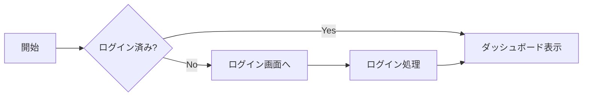

# Hello nomsidian

これは動作確認用のサンプルです。

## リスト

- 項目1
- 項目2
  - ネスト

## タスク

- [x] プロジェクト雛形作成
- [ ] エディタ実装確認

## コード

```csharp
Console.WriteLine("Hello, nomsidian!");
```

## テーブル

| 項目 | 値 |
| --- | --- |
| A | 1 |
| B | 2 |

> 引用テキストのテストです。

## link test

- [Yahoo Japan](http://www.yahoo.co.jp)
- 

## Mermaid



