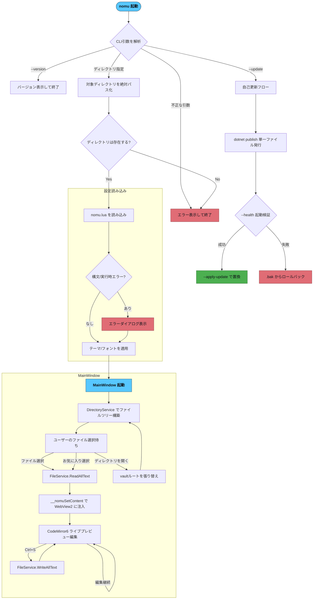
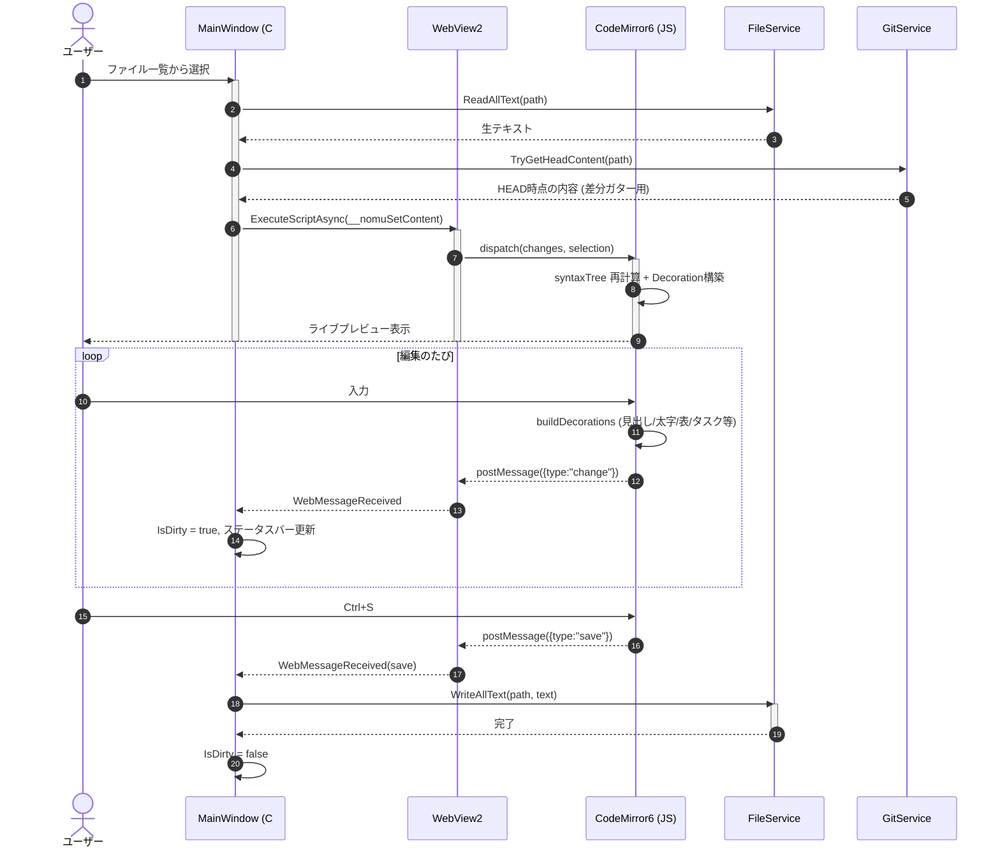
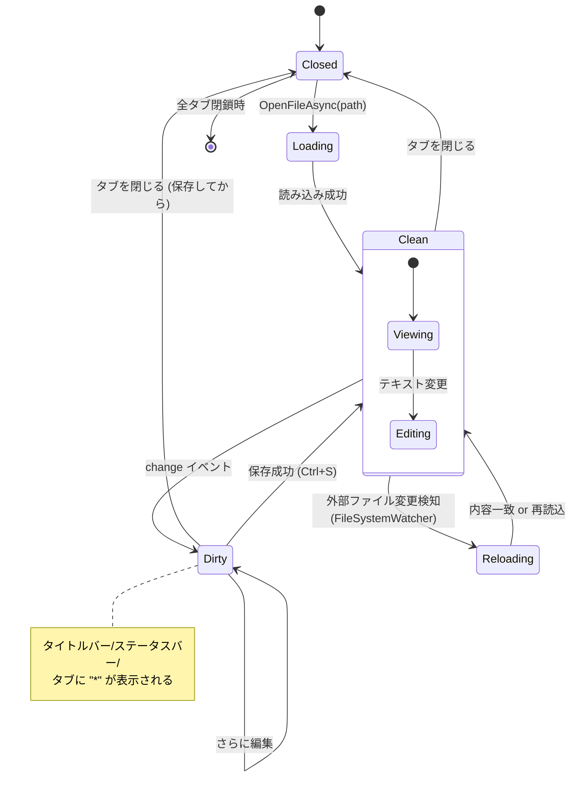
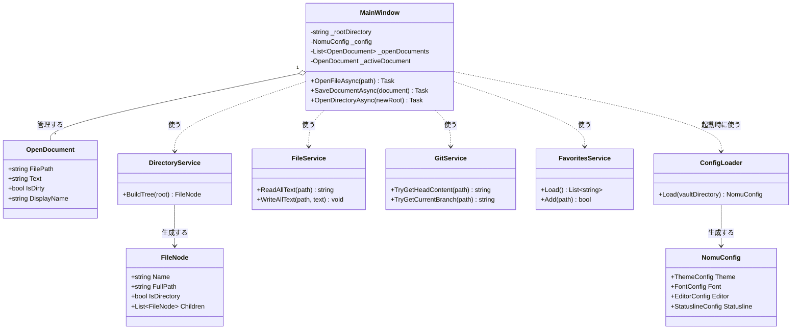

# Mermaid 動作確認

複雑なMermaid図をいくつか置いて、ライブプレビューでの描画を確認するためのファイル。

## フローチャート（サブグラフ・分岐・スタイル指定）

```mermaid
flowchart TD
    Start([nomu 起動]) --> ParseArgs{CLI引数を解析}

    ParseArgs -->|--version| ShowVersion[バージョン表示して終了]
    ParseArgs -->|--update| SelfUpdate[自己更新フロー]
    ParseArgs -->|ディレクトリ指定| ResolveDir[対象ディレクトリを絶対パス化]
    ParseArgs -->|不正な引数| ShowError[エラー表示して終了]

    ResolveDir --> DirExists{ディレクトリは存在する?}
    DirExists -->|No| ShowError
    DirExists -->|Yes| LoadConfig[nomu.lua を読み込み]

    subgraph Config [設定読み込み]
        LoadConfig --> ConfigOk{構文/実行時エラー?}
        ConfigOk -->|あり| ShowConfigError[エラーダイアログ表示]
        ConfigOk -->|なし| ApplyTheme[テーマ/フォントを適用]
        ShowConfigError --> ApplyTheme
    end

    ApplyTheme --> InitWindow[MainWindow 起動]

    subgraph UI [MainWindow]
        InitWindow --> BuildTree[DirectoryService でファイルツリー構築]
        BuildTree --> WaitSelect[ユーザーのファイル選択待ち]

        WaitSelect -->|ファイル選択| OpenFile[FileService.ReadAllText]
        WaitSelect -->|ディレクトリを開く| ReRoot[vaultルートを張り替え]
        WaitSelect -->|お気に入り選択| OpenFile

        ReRoot --> BuildTree

        OpenFile --> SetContent[__nomuSetContent で WebView2 に注入]
        SetContent --> LivePreview[CodeMirror6 ライブプレビュー編集]

        LivePreview -->|Ctrl+S| SaveFile[FileService.WriteAllText]
        LivePreview -->|編集継続| LivePreview
        SaveFile --> LivePreview
    end

    SelfUpdate --> Publish[dotnet publish 単一ファイル発行]
    Publish --> HealthCheck{--health 起動検証}
    HealthCheck -->|成功| ApplyUpdate[--apply-update で置換]
    HealthCheck -->|失敗| Rollback[.bak からロールバック]

    classDef entry fill:#57c7ff,stroke:#2c5570,color:#0e1016,font-weight:bold;
    classDef danger fill:#e06c75,stroke:#8a3a3f,color:#12141a;
    classDef success fill:#4caf50,stroke:#2e6b30,color:#0e1016;

    class Start,InitWindow entry;
    class ShowError,ShowConfigError,Rollback danger;
    class ApplyUpdate success;
```

## シーケンス図（C# ⇔ JavaScript のブリッジ）

```mermaid
sequenceDiagram
    autonumber
    actor User as ユーザー
    participant MW as MainWindow (C#)
    participant WV as WebView2
    participant CM as CodeMirror6 (JS)
    participant FS as FileService
    participant Git as GitService

    User->>MW: ファイル一覧から選択
    activate MW
    MW->>FS: ReadAllText(path)
    FS-->>MW: 生テキスト
    MW->>Git: TryGetHeadContent(path)
    Git-->>MW: HEAD時点の内容 (差分ガター用)

    MW->>WV: ExecuteScriptAsync(__nomuSetContent)
    activate WV
    WV->>CM: dispatch(changes, selection)
    activate CM
    CM->>CM: syntaxTree 再計算 + Decoration構築
    CM-->>User: ライブプレビュー表示
    deactivate CM
    deactivate WV
    deactivate MW

    loop 編集のたび
        User->>CM: 入力
        CM->>CM: buildDecorations (見出し/太字/表/タスク等)
        CM-->>WV: postMessage({type:"change"})
        WV-->>MW: WebMessageReceived
        MW->>MW: IsDirty = true, ステータスバー更新
    end

    User->>CM: Ctrl+S
    CM-->>WV: postMessage({type:"save"})
    WV-->>MW: WebMessageReceived(save)
    MW->>FS: WriteAllText(path, text)
    activate FS
    FS-->>MW: 完了
    deactivate FS
    MW->>MW: IsDirty = false
```

## 状態遷移図（開いているドキュメントのライフサイクル）

```mermaid
stateDiagram-v2
    [*] --> Closed

    Closed --> Loading: OpenFileAsync(path)
    Loading --> Clean: 読み込み成功

    state Clean {
        [*] --> Viewing
        Viewing --> Editing: テキスト変更
    }

    Clean --> Dirty: change イベント
    Dirty --> Clean: 保存成功 (Ctrl+S)
    Dirty --> Dirty: さらに編集

    Clean --> Reloading: 外部ファイル変更検知(FileSystemWatcher)
    Reloading --> Clean: 内容一致 or 再読込

    Dirty --> Closed: タブを閉じる (保存してから)
    Clean --> Closed: タブを閉じる

    Closed --> [*]: 全タブ閉鎖時

    note right of Dirty
        タイトルバー/ステータスバー/
        タブに "*" が表示される
    end note
```

## クラス図（主要なC#型の関係）

```mermaid
classDiagram
    class MainWindow {
        -string _rootDirectory
        -NomuConfig _config
        -List~OpenDocument~ _openDocuments
        -OpenDocument _activeDocument
        +OpenFileAsync(path) Task
        +SaveDocumentAsync(document) Task
        +OpenDirectoryAsync(newRoot) Task
    }

    class OpenDocument {
        +string FilePath
        +string Text
        +bool IsDirty
        +string DisplayName
    }

    class FileNode {
        +string Name
        +string FullPath
        +bool IsDirectory
        +List~FileNode~ Children
    }

    class DirectoryService {
        +BuildTree(root) FileNode
    }

    class FileService {
        +ReadAllText(path) string
        +WriteAllText(path, text) void
    }

    class GitService {
        +TryGetHeadContent(path) string
        +TryGetCurrentBranch(path) string
    }

    class FavoritesService {
        +Load() List~string~
        +Add(path) bool
    }

    class ConfigLoader {
        +Load(vaultDirectory) NomuConfig
    }

    class NomuConfig {
        +ThemeConfig Theme
        +FontConfig Font
        +EditorConfig Editor
        +StatuslineConfig Statusline
    }

    MainWindow "1" o-- "*" OpenDocument : 管理する
    MainWindow ..> DirectoryService : 使う
    MainWindow ..> FileService : 使う
    MainWindow ..> GitService : 使う
    MainWindow ..> FavoritesService : 使う
    MainWindow ..> ConfigLoader : 起動時に使う
    DirectoryService --> FileNode : 生成する
    ConfigLoader --> NomuConfig : 生成する
```
